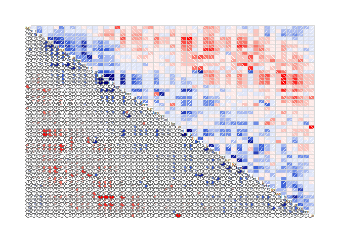

## Intro

This project's goal is to use the data on belt ,arm,dumbel from accelerometers to determine how well an individual was performing barbell lifts.For input 6 participants are asked to lift barbell correctly and incorrectly in 5 various ways.

## Libraries and Reading Data

```r
library(caret)
```

```
## Loading required package: lattice
```

```
## Loading required package: ggplot2
```

```r
library(corrgram)
```

```
## 
## Attaching package: 'corrgram'
```

```
## The following object is masked from 'package:lattice':
## 
##     panel.fill
```

```r
lifts.train = read.csv('pml-training.csv')
lifts.test  = read.csv('pml-testing.csv')
```
## Executive Summary

We now see the shape of the train and test using dim(),we found  160 columns and rows with 19216 dimensions.It requires simplifying feature space.
Our steps include

  ->Explore data visually, identify and apply data cleansing.
  ->Simplify the feature space by identifying highly correlated features and create another feature set by applying PCA.
  ->Select and train the algorithm with cross-validation.
  ->Select the best performing one based on the OOB error.
  ->Run  prediction.

```r
print(dim(lifts.train))
```

```
## [1] 19622   160
```

```r
print(dim(lifts.test))
```

```
## [1]  20 160
```

## Data Exploration & Data Cleaning

## Rows

Exclude aggregated rows from the training set (rows with new_window = yes)

```r
lifts.train = lifts.train[lifts.train$new_window == 'no', ]
```

## Columns

Columns to be removed: metadata columns ('X' refers to the first unnamed column)

```r
md_columns = c('X', 'user_name', 'raw_timestamp_part_1', 'raw_timestamp_part_2',
               'cvtd_timestamp', 'new_window', 'num_window')
lifts.train = lifts.train[ , !(names(lifts.train) %in% md_columns)]
```


# Columns to be removed: no values in the the testing data set

```r
lifts.test.nona <- lifts.test[ , colSums(is.na(lifts.test)) < nrow(lifts.test) ]
names.nona.variables <- names(lifts.test.nona)
names.nona.variables <- names.nona.variables[(names.nona.variables %in% names(lifts.train))]
names.nona <- append(names.nona.variables, 'classe')

lifts.train = lifts.train[names.nona]
```


## Correlation 

We can find there are correlated variables and can simplify the data using them by further optons
  -> Using all 53 features we have got after the initial data cleansing.
  ->Applying PCA before training the model. 


```r
lifts.train.sample = lifts.train[sample(nrow(lifts.train), 500), ]

corrgram(lifts.train.sample, order = TRUE, lower.panel=panel.pie)
```

<!-- -->


## Prediction Models

For prediction , random forest model is trained with all 53 variables and another version with feature space reduced by PCA.5 fold cross validation is used in both cases to estimate sample error.

```r
fitRfCv <- train(classe ~ ., data = lifts.train, ntree = 100, method = 'rf', trControl = trainControl(method = "cv", number = 5))
fitRfCv$finalModel
```

```
## 
## Call:
##  randomForest(x = x, y = y, ntree = 100, mtry = param$mtry) 
##                Type of random forest: classification
##                      Number of trees: 100
## No. of variables tried at each split: 2
## 
##         OOB estimate of  error rate: 0.63%
## Confusion matrix:
##      A    B    C    D    E class.error
## A 5464    7    0    0    0 0.001279474
## B   19 3691    8    0    0 0.007261969
## C    1   21 3322    8    0 0.008949881
## D    0    0   49 3095    3 0.016523673
## E    0    0    1    5 3522 0.001700680
```

```r
fitRfPcaCv <- train(classe ~ ., data = lifts.train, ntree = 100, method = 'rf',
    preProcess = "pca", trControl = trainControl(method = "cv", number = 5))
```

```
## Warning in randomForest.default(x, y, mtry = param$mtry, ...): invalid
## mtry: reset to within valid range

## Warning in randomForest.default(x, y, mtry = param$mtry, ...): invalid
## mtry: reset to within valid range

## Warning in randomForest.default(x, y, mtry = param$mtry, ...): invalid
## mtry: reset to within valid range

## Warning in randomForest.default(x, y, mtry = param$mtry, ...): invalid
## mtry: reset to within valid range

## Warning in randomForest.default(x, y, mtry = param$mtry, ...): invalid
## mtry: reset to within valid range

## Warning in randomForest.default(x, y, mtry = param$mtry, ...): invalid
## mtry: reset to within valid range

## Warning in randomForest.default(x, y, mtry = param$mtry, ...): invalid
## mtry: reset to within valid range

## Warning in randomForest.default(x, y, mtry = param$mtry, ...): invalid
## mtry: reset to within valid range

## Warning in randomForest.default(x, y, mtry = param$mtry, ...): invalid
## mtry: reset to within valid range

## Warning in randomForest.default(x, y, mtry = param$mtry, ...): invalid
## mtry: reset to within valid range
```

```r
fitRfPcaCv$finalModel
```

```
## 
## Call:
##  randomForest(x = x, y = y, ntree = 100, mtry = param$mtry) 
##                Type of random forest: classification
##                      Number of trees: 100
## No. of variables tried at each split: 2
## 
##         OOB estimate of  error rate: 2.09%
## Confusion matrix:
##      A    B    C    D    E class.error
## A 5427   13   21    5    5 0.008042405
## B   53 3620   38    0    7 0.026358257
## C    9   45 3264   31    3 0.026252983
## D    5    5  106 3024    7 0.039084843
## E    1   12   20   15 3480 0.013605442
```

## Prediction

The Default threshold is 95% variance for prediction using chosen model

```r
lifts.prediction = predict(fitRfCv, lifts.test)

print(lifts.prediction)
```

```
##  [1] B A B A A E D B A A B C B A E E A B B B
## Levels: A B C D E
```
